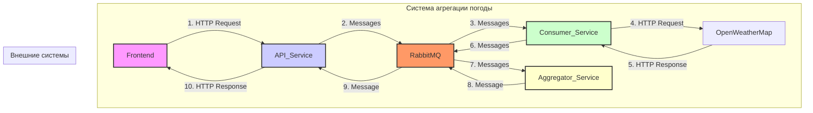

# Практическая работа - Разработка распределенной системы агрегации прогнозов погоды с использованием Spring Boot и RabbitMQ
##  Цель работы
Целью данной лабораторной работы является получение практических навыков в разработке распределенных систем
с использованием микросервисной архитектуры, брокера сообщений RabbitMQ и реализации интеграционных паттернов (Enterprise Integration Patterns). По завершении работы студенты создадут полнофункциональное приложение
для асинхронной агрегации данных из внешнего API.

В современных распределенных системах компоненты (микросервисы) должны эффективно обмениваться данными. Прямые вызовы (например, через REST API) создают сильную связанность между сервисами. Если один сервис недоступен, вся цепочка вызовов может прерваться. 

**Системы обмена сообщениями (Message Queuing)** решают эту проблему, вводя промежуточный компонент — **брокер сообщений**. Сервисы не общаются друг с другом напрямую, а отправляют сообщения в очередь. Другие сервисы подписываются на эти очереди и забирают сообщения для обработки по мере возможности. Это обеспечивает **слабую связанность** и **асинхронность**.

**RabbitMQ** — это один из самых популярных брокеров сообщений с открытым исходным кодом. Он реализует протокол AMQP (Advanced Message Queuing Protocol) и предоставляет надежный механизм для асинхронной доставки сообщений.

**Основные концепции RabbitMQ:**
- **Producer:** Приложение, которое отправляет сообщения.
- **Consumer:** Приложение, которое получает сообщения.
- **Queue:** Очередь, буфер для хранения сообщений.
- **Exchange:** Точка обмена, которая получает сообщения от Producer и направляет их в одну или несколько очередей. Тип exchange (Direct, Topic, Fanout) определяет логику маршрутизации.
- **Binding:** Правило, которое связывает exchange с очередью.

Enterprise Integration Patterns (EIP)
EIP — это каталог проверенных решений для типичных задач интеграции корпоративных приложений. В данной
работе мы реализуем несколько ключевых паттернов.

Message Channel
Канал сообщений — это базовый паттерн, представляющий собой виртуальный канал, по которому сообщения передаются от одного компонента к другому. В RabbitMQ роль каналов выполняют очереди.

Message Router
Маршрутизатор сообщений получает сообщение и направляет его в один из нескольких каналов на основе определенных условий. В нашем проекте weather-api-service будет выступать в роли маршрутизатора, разбивая один
входящий запрос на множество сообщений для каждого города.

Request-Reply
Паттерн для реализации двусторонней коммуникации. Отправитель посылает сообщение-запрос и ожидает
сообщение-ответ. В асинхронном мире это реализуется с помощью двух каналов (один для запросов, другой для
ответов) и Correlation ID — уникального идентификатора, который присутствует как в запросе, так и в ответе,
позволяя сопоставить их.

Aggregator
Агрегатор — это компонент, который получает поток связанных сообщений и объединяет их в одно итоговое сообщение. Это один из самых сложных, но мощных паттернов.
**Как работает Aggregator:**
1. **Correlation:** Все сообщения, относящиеся к одной группе, должны иметь общий **Correlation ID**.
2. **Completion Strategy:** Агрегатор должен знать, когда группа сообщений считается полной. Обычно для этого используется счетчик ожидаемых сообщений.
3. **Aggregation Store:** Необходимо временное хранилище для накопления сообщений до завершения группы.
4. **Timeout:** Чтобы система не ждала вечно потерянные сообщения, используется таймаут. Если за отведенное время группа не собралась, она обрабатывается как есть (возможно, с ошибкой).

Наша система будет состоять из четырех сервисов и брокера сообщений RabbitMQ.



**Поток данных:**
1.  **Frontend** отправляет HTTP POST-запрос со списком городов на **Weather API Service**.
2.  **API Service** генерирует `correlationId`, разбивает запрос на отдельные сообщения (по одному на город) и отправляет их в очередь `weather.request.queue` в **RabbitMQ**.
3.  **Weather Consumer Service** получает сообщения из этой очереди.
4.  Для каждого сообщения **Consumer Service** делает HTTP-запрос к внешнему **OpenWeatherMap API**.
5.  Получив ответ, **Consumer Service** формирует сообщение-ответ и отправляет его в очередь `weather.response.queue`.
6.  **Weather Aggregator Service** слушает очередь ответов, накапливая их в своем хранилище и группируя по `correlationId`.
7.  Когда все ответы для одного запроса собраны (счетчик полученных сообщений равен общему числу городов), **Aggregator Service** формирует единый отчет.
8.  Этот отчет отправляется в очередь `weather.aggregated.queue`.
9.  **API Service** слушает эту очередь, получает готовый отчет и, наконец, отправляет его в виде HTTP-ответа на **Frontend**.

---

java -version
```
java version "23.0.1" 2024-10-15
Java(TM) SE Runtime Environment (build 23.0.1+11-39)
Java HotSpot(TM) 64-Bit Server VM (build 23.0.1+11-39, mixed mode, sharing)
```

mvn -version
```
Apache Maven 3.9.9 (8e8579a9e76f7d015ee5ec7bfcdc97d260186937)
Maven home: C:\home\app\maven\apache-maven-3.9.9
Java version: 23.0.1, vendor: Oracle Corporation, runtime: C:\Program Files\Java\jdk-23
Default locale: ru_RU, platform encoding: UTF-8
OS name: "windows 11", version: "10.0", arch: "amd64", family: "windows"
```

docker --version
```
Docker version 27.4.0, build bde2b89
```


