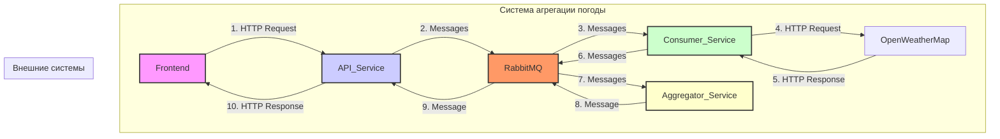

# Практическая работа - Разработка распределенной системы агрегации прогнозов погоды с использованием Spring Boot и RabbitMQ
##  Цель работы

Целью данной лабораторной работы является получение практических навыков в разработке распределенных систем
с использованием микросервисной архитектуры, брокера сообщений RabbitMQ и реализации интеграционных паттернов (Enterprise Integration Patterns). По завершении работы студенты создадут полнофункциональное приложение
для асинхронной агрегации данных из внешнего API.

---

Технологии: Spring Boot 3.2.0, RabbitMQ 3.x, Java 17, Maven, Docker

---

В современных распределенных системах компоненты (микросервисы) должны эффективно обмениваться данными. Прямые вызовы (например, через REST API) создают сильную связанность между сервисами. Если один сервис недоступен, вся цепочка вызовов может прерваться. 

---

**Системы обмена сообщениями (Message Queuing)** решают эту проблему, вводя промежуточный компонент — **брокер сообщений**. Сервисы не общаются друг с другом напрямую, а отправляют сообщения в очередь. Другие сервисы подписываются на эти очереди и забирают сообщения для обработки по мере возможности. Это обеспечивает **слабую связанность** и **асинхронность**.

---

**RabbitMQ** — это один из самых популярных брокеров сообщений с открытым исходным кодом. Он реализует протокол AMQP (Advanced Message Queuing Protocol) и предоставляет надежный механизм для асинхронной доставки сообщений.

---

**Основные концепции RabbitMQ:**
- **Producer:** Приложение, которое отправляет сообщения.
- **Consumer:** Приложение, которое получает сообщения.
- **Queue:** Очередь, буфер для хранения сообщений.
- **Exchange:** Точка обмена, которая получает сообщения от Producer и направляет их в одну или несколько очередей. Тип exchange (Direct, Topic, Fanout) определяет логику маршрутизации.
- **Binding:** Правило, которое связывает exchange с очередью.

---

**Enterprise Integration Patterns (EIP)**

EIP — это каталог проверенных решений для типичных задач интеграции корпоративных приложений. В данной
работе мы реализуем несколько ключевых паттернов.

---

**Message Channel**

Канал сообщений — это базовый паттерн, представляющий собой виртуальный канал, по которому сообщения передаются от одного компонента к другому. В RabbitMQ роль каналов выполняют очереди.

---

**Message Router**

Маршрутизатор сообщений получает сообщение и направляет его в один из нескольких каналов на основе определенных условий. В нашем проекте weather-api-service будет выступать в роли маршрутизатора, разбивая один
входящий запрос на множество сообщений для каждого города.

---

**Request-Reply**

Паттерн для реализации двусторонней коммуникации. Отправитель посылает сообщение-запрос и ожидает
сообщение-ответ. В асинхронном мире это реализуется с помощью двух каналов (один для запросов, другой для
ответов) и Correlation ID — уникального идентификатора, который присутствует как в запросе, так и в ответе,
позволяя сопоставить их.

---

**Aggregator**
Агрегатор — это компонент, который получает поток связанных сообщений и объединяет их в одно итоговое сообщение. Это один из самых сложных, но мощных паттернов.
**Как работает Aggregator:**
1. **Correlation:** Все сообщения, относящиеся к одной группе, должны иметь общий **Correlation ID**.
2. **Completion Strategy:** Агрегатор должен знать, когда группа сообщений считается полной. Обычно для этого используется счетчик ожидаемых сообщений.
3. **Aggregation Store:** Необходимо временное хранилище для накопления сообщений до завершения группы.
4. **Timeout:** Чтобы система не ждала вечно потерянные сообщения, используется таймаут. Если за отведенное время группа не собралась, она обрабатывается как есть (возможно, с ошибкой).

---

## Обзор проекта
### Архитектура системы
Система состоит из 4 независимых микросервисов, взаимодействующих через брокер сообщений RabbitMQ.
```
┌─────────────┐      ┌──────────────┐      ┌───────────────┐
│   Frontend  │─────▶│  API Service │─────▶│   RabbitMQ    │
└─────────────┘      └──────────────┘      └───────┬───────┘
                                                    │
                                    ┌───────────────┴───────────────┐
                                    │                               │
                            ┌───────▼────────┐            ┌────────▼─────────┐
                            │    Consumer    │            │    Aggregator    │
                            │    Service     │            │     Service      │
                            └────────────────┘            └──────────────────┘
                                    │                               │
                                    ▼                               ▼
                            OpenWeatherMap API          Агрегация результатов
```



**Поток данных:**
1.  **Frontend** отправляет HTTP POST-запрос со списком городов на **Weather API Service**.
2.  **API Service** генерирует `correlationId`, разбивает запрос на отдельные сообщения (по одному на город) и отправляет их в очередь `weather.request.queue` в **RabbitMQ**.
3.  **Weather Consumer Service** получает сообщения из этой очереди.
4.  Для каждого сообщения **Consumer Service** делает HTTP-запрос к внешнему **OpenWeatherMap API**.
5.  Получив ответ, **Consumer Service** формирует сообщение-ответ и отправляет его в очередь `weather.response.queue`.
6.  **Weather Aggregator Service** слушает очередь ответов, накапливая их в своем хранилище и группируя по `correlationId`.
7.  Когда все ответы для одного запроса собраны (счетчик полученных сообщений равен общему числу городов), **Aggregator Service** формирует единый отчет.
8.  Этот отчет отправляется в очередь `weather.aggregated.queue`.
9.  **API Service** слушает эту очередь, получает готовый отчет и, наконец, отправляет его в виде HTTP-ответа на **Frontend**.

---

java -version
```
java version "23.0.1" 2024-10-15
Java(TM) SE Runtime Environment (build 23.0.1+11-39)
Java HotSpot(TM) 64-Bit Server VM (build 23.0.1+11-39, mixed mode, sharing)
```

mvn -version
```
Apache Maven 3.9.9 (8e8579a9e76f7d015ee5ec7bfcdc97d260186937)
Maven home: C:\home\app\maven\apache-maven-3.9.9
Java version: 23.0.1, vendor: Oracle Corporation, runtime: C:\Program Files\Java\jdk-23
Default locale: ru_RU, platform encoding: UTF-8
OS name: "windows 11", version: "10.0", arch: "amd64", family: "windows"
```

docker --version
```
Docker version 27.4.0, build bde2b89
```
## Базовая реализация
### Компоненты системы
#### Weather API Service (порт 8080)

- REST API endpoint: POST /api/weather/forecast
- Генерация Correlation ID для связи сообщений
- Реализация паттерна Message Router
- Асинхронное ожидание результата через CompletableFuture

```
javapublic AggregatedWeatherReport processWeatherRequest(WeatherRequestDto requestDto) {
    String correlationId = UUID.randomUUID().toString();
    CompletableFuture<AggregatedWeatherReport> future = new CompletableFuture<>();
    pendingRequests.put(correlationId, future);
    
    // Отправка сообщения для каждого города
    for (String city : requestDto.getCities()) {
        WeatherMessage message = new WeatherMessage(correlationId, city, totalCities, ...);
        rabbitTemplate.convertAndSend(exchangeName, requestRoutingKey, message);
    }
    
    return future.get(60, TimeUnit.SECONDS);
}
```

#### Weather Consumer Service (порт 8081)

- Получение сообщений из очереди weather.request.queue
- Вызов OpenWeatherMap API
- Manual acknowledgment для контроля обработки
- Rate limiting: 1 запрос/секунду

Конфигурация:
```
yamlspring:
  rabbitmq:
    listener:
      simple:
        concurrency: 5          # 5 параллельных потоков
        max-concurrency: 10
        acknowledge-mode: manual
```

#### Weather Aggregator Service (порт 8082)

- Реализация паттерна Aggregator
- Сбор ответов по Correlation ID
- Completion Strategy: receivedCount >= totalCities
- Timeout-based cleanup: удаление устаревших контекстов

Ключевой механизм:
```
javasynchronized (context) {
    context.addResponse(response);
    if (context.isComplete()) {
        AggregatedWeatherReport report = context.buildReport();
        rabbitTemplate.convertAndSend(exchangeName, aggregatedRoutingKey, report);
        aggregationStore.remove(correlationId);
    }
}
```

### Технические детали
Очереди RabbitMQ:

- weather.request.queue - запросы на получение погоды
- weather.response.queue - ответы от Consumer
- weather.aggregated.queue - агрегированные результаты
- weather.request.dlq - Dead Letter Queue

#### Решенные проблемы:

- Сериализация LocalDateTime - добавлен модуль jackson-datatype-jsr310
- Конфигурация очередей - решен конфликт параметров DLX
- Manual acknowledgment - корректная обработка basicAck/basicNack


---

## Дополнительные задания
### Задание 1: Обработка ошибок и Dead Letter Queue (DLQ)
Реализация:
```
java@Bean
public Queue requestQueue() {
    Map<String, Object> args = new HashMap<>();
    args.put("x-dead-letter-exchange", exchangeName);
    args.put("x-dead-letter-routing-key", "weather.request.dlq");
    return QueueBuilder.durable(requestQueueName).withArguments(args).build();
}
DLQ Listener:
java@RabbitListener(queues = "weather.request.dlq")
public void handleDeadLetter(WeatherMessage weatherMessage) {
    log.error("=== DEAD LETTER MESSAGE RECEIVED ===");
    log.error("City: {}", weatherMessage.getCity());
    // Возможна дальнейшая обработка: сохранение в БД, уведомление
}
```

Результат:

- Проблемные сообщения изолируются в DLQ
- Предотвращение бесконечных циклов обработки
- Возможность анализа ошибок постфактум


---

### Задание 2: Масштабирование Consumer’а
Конфигурация:
```
yamlspring:
  rabbitmq:
    listener:
      simple:
        concurrency: 5
        max-concurrency: 10
        prefetch: 5
```

#### Результаты тестирования:

| Параметр | До масштабирования | После масштабирования |
|----------|-------------------|----------------------|
| Потоков обработки | 1 | 5 |
| Время обработки 10 городов | ~10 секунд | ~2 секунды |

**Логи подтверждают параллельную обработку:**
```
INFO : Received weather request for city: London
INFO : Received weather request for city: Paris
INFO : Received weather request for city: Moscow
INFO : Received weather request for city: Tokyo
INFO : Received weather request for city: New York
```

---

### Задание 3: Внедрение кэширования
Технологии:

Spring Boot Cache + Caffeine Cache
TTL: 5 минут
Синхронизация параллельных запросов: sync=true

Конфигурация:
```
java@Cacheable(value = "weather", key = "#city", sync = true)
public OpenWeatherMapResponse getWeatherForCity(String city) {
    rateLimiter.acquire();
    log.info("🌐 CACHE MISS - Fetching from API for: {}", city);
    // ... HTTP запрос к API
}
```

#### Результаты тестирования:

**Запрос:** `London, Paris, London, Moscow, Paris, London`

**Логи:**
```
🌐 CACHE MISS - Fetching weather data from API for city: London
✅ Successfully fetched and CACHED weather for city: London

🌐 CACHE MISS - Fetching weather data from API for city: Paris
✅ Successfully fetched and CACHED weather for city: Paris

(London второй раз - БЕЗ "CACHE MISS" - из кэша)

🌐 CACHE MISS - Fetching weather data from API for city: Moscow
✅ Successfully fetched and CACHED weather for city: Moscow

(Paris второй раз - БЕЗ "CACHE MISS" - из кэша!
(London третий раз - БЕЗ "CACHE MISS" - из кэша)
```

#### Критическое решение: `sync=true`

**Проблема:** При параллельной обработке несколько потоков одновременно запрашивали один город, создавая дубликаты HTTP-запросов.

**Решение:** `sync=true` синхронизирует доступ к кэшу по ключу:
```
Поток 1: London → Блокирует ключ → HTTP запрос → Кэширует → Разблокирует
Поток 2: London → Ждёт блокировку → Получает из кэша ✅
Поток 3: London → Получает из кэша ✅
```

---

### Задание 4: Улучшенная стратегия завершения для Aggregator’а

Проблема:

Если одно из сообщений теряется, агрегатор бесконечно ждал. cleanupExpiredAggregations просто удалял контекст без отправки результата.

Решение:

Обновленный DTO:
```
javapublic class AggregatedWeatherReport {
    private String correlationId;
    private int totalCities;
    private List<WeatherData> reports;
    private boolean partial;           // НОВОЕ
    private String partialReason;      // НОВОЕ
    // ...
}
```
Логика отправки частичных результатов:
```
java@Scheduled(fixedDelay = 30000)
public void cleanupExpiredAggregations() {
    aggregationStore.forEach((correlationId, context) -> {
        if (secondsElapsed > timeoutSeconds) {
            String partialReason = String.format(
                "Timeout after %ds: received only %d/%d responses. %d responses missing.",
                timeoutSeconds, context.receivedCount, context.totalCities, missingResponses
            );
            
            AggregatedWeatherReport partialReport = context.buildReport(true, partialReason);
            rabbitTemplate.convertAndSend(exchangeName, aggregatedRoutingKey, partialReport);
            
            aggregationStore.remove(correlationId);
        }
    });
}
```
Обновленный фронтенд:
Отображение предупреждения:
```
javascriptif (report.partial) {
    const warningDiv = document.createElement('div');
    warningDiv.classList.add('partial-warning');
    warningDiv.innerHTML = `
        <strong>⚠️ Предупреждение: Частичный результат</strong>
        <p>${report.partialReason}</p>
    `;
    resultsSection.insertBefore(warningDiv, summaryInfoDiv);
}
```
Бейдж статуса:
```
javascriptconst statusBadge = report.partial 
    ? '⚠️ Частичный результат' 
    : '✓ Полный результат';
```


---

### Задание 5 (Сложное): Переход на WebSockets для Real-time обновлений

Проблема

Использование классического HTTP Request-Reply для асинхронной агрегации создает плохой пользовательский опыт (UX), заставляя клиента долго ждать полного ответа.

Цель

Внедрить WebSockets для обеспечения постоянного двунаправленного соединения между клиентом и weather-api-service, позволяя отправлять Real-time обновления результатов по мере их готовности.

Реализация (Обзор)

**Backend (weather-api-service) Адаптация:**

- Добавлен spring-boot-starter-websocket.

- Создан WebSocket-хендлер для управления клиентскими сессиями.

- Сервис больше не использует CompletableFuture, а хранит WebSocketSession клиента, связанный с correlationId.

- При получении сообщения из weather.aggregated.queue, API Service ищет соответствующую активную сессию и отправляет ей JSON-обновление.

**Frontend (weather-frontend) Адаптация:**

- Заменен fetch на new WebSocket("ws://localhost:8080/ws/weather").

- Логика socket.onmessage настроена на получение потока данных (сообщений) и динамическое обновление UI.

- Реализованы функции для отслеживания общего прогресса, отображения статуса каждого города и вывода финального/частичного отчета.

Результаты


---


---

1. Запрос 5 городов

Обновления появляются через ~1 секунду после начала обработки.

Динамическое отображение: Каждый город появляется в таблице по мере его обработки Consumer'ом и отправки через WebSocket.

---

2. Длительный запрос (20 городов)

Пользователь видит постоянный прогресс, а не зависший индикатор.

Улучшенный UX: Прогресс-бар и счетчик обновляются плавно (например, 5% → 10% → 15%...).

Ключевой эффект: С WebSockets реализован паттерн Real-time Publishing, что устранило проблему "бутылочного горлышка" в обратном пути (от Aggregator к Frontend) и значительно улучшило пользовательский опыт.

---

### Улучшенный фронтенд

#### Новый дизайн:

**Технологии:**
- Tailwind CSS для современного UI
- Асинхронное обновление без перезагрузки страницы

**Ключевые возможности:**

1. **Частичный вывод результатов:**
   - Результаты появляются по мере готовности
   - Прогресс-бар показывает процент завершения
   - Статус каждого города обновляется динамически

2. **Визуальная индикация:**
```
   ✓ London: 9.46°C, Broken clouds     [Успешно]
   ✓ Paris: 2.73°C, Mist                [Успешно]
   ⚠ New York: 404 Not Found            [Ошибка]
   ⏳ Tokyo: Обрабатывается...           [Ожидание]
```

3. **Прогресс-бар:**
```
   Прогресс: 3 из 5                     60%
   ████████████████████░░░░░░░░░░░░░
Пример интерфейса:
html<div class="bg-gray-800 p-6 rounded-2xl">
    <div class="flex justify-between items-center mb-4">
        <h2>Статус Задачи <span class="text-blue-400">ID: corr-123</span></h2>
        <div class="px-3 py-1 bg-yellow-800 text-yellow-300 rounded-full">
            В процессе
        </div>
    </div>
    
    <div class="progress-bar">
        <div style="width: 60%" class="bg-blue-500 transition-all duration-700">
        </div>
    </div>
    
    <!-- Карточки результатов -->
</div>
```

---

## Выводы

✅ **Успешно реализованы:**
1. Базовая микросервисная архитектура с RabbitMQ
2. Dead Letter Queue для изоляции проблемных сообщений
3. Масштабирование Consumer (5 параллельных потоков)
4. Кэширование с синхронизацией (`sync=true`)
5. Частичные результаты при таймауте Aggregator
6. Real-time обновления через WebSockets
7. Современный responsive фронтенд с частичным выводом

✅ **Реализованные паттерны EIP:**
- Message Channel
- Message Router
- Request-Reply
- Aggregator
- Dead Letter Queue
- Real-time Publisher (на базе WebSockets)

---

## Приложения

### Структура проекта
```
weather-aggregator-system/
├── weather-api-service/                           # Backend REST API
│ ├── src/main/java/com/weather/api/
│ │ ├── config/                                    # Конфигурация RabbitMQ
│ │ │ ├── RabbitMQConfig.java
│ │ │ ├── WebSocketConfig.java
│ │ ├── controller/                                # REST контроллеры
│ │ │ ├── WeatherController.java
│ │ ├── dto/                                         # Data Transfer Objects
│ │ │ ├── AggregatedWeatherReport.java
│ │ │ ├── WeatherData.java
│ │ │ ├── WeatherMessage.java
│ │ │ ├── WeatherRequestDto.java
│ │ └── handler/
│ │ │ ├── WeatherWebSocketHandler.java
│ │ └── service/                                 # Бизнес-логика
│ │ │ ├── WeatherService.java
│ ├── pom.xml
│ └── WeatherApiApplication.java
│
├── weather-consumer-service/ # Consumer для вызова Weather API
│ ├── src/main/java/com/weather/consumer/
│ │ ├── client/ # HTTP клиент для Weather API
WeatherApiClient.java
│ │ ├── config/ # Конфигурация
RabbitMQConfig.java
CacheConfig.java
│ │ ├── dto/ # DTO
weather-consumer-service\src\main\java\com\weather\consumer\dto\OpenWeatherMapResponse.java
weather-consumer-service\src\main\java\com\weather\consumer\dto\WeatherMessage.java
C:\Users\diamo\PycharmProjects\Rabbit\weather-consumer-service\src\main\java\com\weather\consumer\dto\WeatherResponse.java

│ │ └── service/ # Обработка сообщений
weather-consumer-service\src\main\java\com\weather\consumer\service\DeadLetterQueueService.java
weather-consumer-service\src\main\java\com\weather\consumer\service\WeatherConsumerService.java

weather-consumer-service\src\main\java\com\weather\consumer\WeatherConsumerApplication.java
│ └── pom.xml

├── weather-aggregator-service/ # Aggregator для сбора результатов
│ ├── src/main/java/com/weather/aggregator/
│ │ ├── config/ # Конфигурация
RabbitMQConfig.java
│ │ ├── dto/ # DTO
weather-aggregator-service\src\main\java\com\weather\aggregator\dto\AggregatedWeatherReport.java
weather-aggregator-service\src\main\java\com\weather\aggregator\dto\WeatherData.java
weather-aggregator-service\src\main\java\com\weather\aggregator\dto\WeatherResponse.java
│ │ └── service/ # Логика агрегации
weather-aggregator-service\src\main\java\com\weather\aggregator\service\WeatherAggregatorService.java

weather-aggregator-service\src\main\java\com\weather\aggregator\WeatherAggregatorApplication.java
│ └── pom.xml
├── weather-frontend/ # Frontend приложение
│ ├── css/style.css
│ ├── js/app.js
│ └── index.html
├── docker-compose.yml # Docker Compose для RabbitMQ


weather-aggregator-system/
├── weather-api-service/                            # Backend REST API (Producer)
│   ├── src/main/java/com/weather/api/
│   │   ├── config/                                 # Конфигурация брокера и сокетов
│   │   │ ├── **RabbitMQConfig.java**                # Настройка очередей для запросов
│   │   │ └── **WebSocketConfig.java**              # Настройка WebSocket-сервера (для ответов)
│   │   ├── controller/                             # Обработка входящих REST-запросов
│   │   │ └── **WeatherController.java**            # Принимает запрос от Frontend, отправляет в RabbitMQ
│   │   ├── dto/                                    # Объекты передачи данных
│   │   │ ├── **AggregatedWeatherReport.java**    # Финальный агрегированный отчет (для отправки на Frontend)
│   │   │ ├── **WeatherData.java**                  # Промежуточные данные о погоде
│   │   │ ├── **WeatherMessage.java**               # Сообщение, отправляемое в очередь
│   │   │ └── **WeatherRequestDto.java**            # DTO для входящего REST-запроса (например, город)
│   │   └── service/                                # Бизнес-логика
│   │   │ └── **WeatherService.java**               # Логика отправки запроса в очередь и работы с WebSockets
│   ├── **pom.xml**                                  # Maven-зависимости (Web, RabbitMQ, WebSocket)
│   └── **WeatherApiApplication.java**              # Точка входа в API-сервис
│
├── weather-consumer-service/                      # Consumer для вызова Weather API
│   ├── src/main/java/com/weather/consumer/
│   │   ├── client/                                 # HTTP клиент для внешних API
│   │   │ └── **WeatherApiClient.java**               # Вызов сторонних погодных API (например, OpenWeatherMap)
│   │   ├── config/                                 # Конфигурация
│   │   │ ├── **RabbitMQConfig.java**                # Настройка очереди для входящих запросов
│   │   │ └── **CacheConfig.java**                  # Настройка кэширования (например, Redis или Caffeine)
│   │   ├── dto/                                    # Data Transfer Objects
│   │   │ ├── **OpenWeatherMapResponse.java**       # DTO для ответа от внешнего API
│   │   │ ├── **WeatherMessage.java**               # Входящее сообщение из очереди (запрос)
│   │   │ └── **WeatherResponse.java**              # Структура данных для ответа, отправляемого агрегатору
│   │   └── service/                                # Обработка сообщений
│   │   │ ├── **DeadLetterQueueService.java**     # Логика для обработки ошибок (DLQ)
│   │   │ └── **WeatherConsumerService.java**       # Главный слушатель RabbitMQ, вызывающий API и отправляющий результат агрегатору
│   ├── **WeatherConsumerApplication.java**         # Точка входа в Consumer-сервис
│   └── **pom.xml**                                  # Maven-зависимости (RabbitMQ, HTTP Client, Cache)
│
├── weather-aggregator-service/                    # Aggregator для сбора и усреднения результатов
│   ├── src/main/java/com/weather/aggregator/
│   │   ├── config/                                 # Конфигурация
│   │   │ └── **RabbitMQConfig.java**                # Настройка очереди для входящих ответов от Consumer
│   │   ├── dto/                                    # Data Transfer Objects
│   │   │ ├── **AggregatedWeatherReport.java**    # Финальный агрегированный отчет
│   │   │ ├── **WeatherData.java**                  # Промежуточные данные
│   │   │ └── **WeatherResponse.java**              # Ответ от Consumer
│   │   └── service/                                # Логика агрегации
│   │   │ └── **WeatherAggregatorService.java**   # Слушатель RabbitMQ, собирающий N ответов, агрегирующий их и отправляющий финальный отчет обратно в Weather API (для WebSockets)
│   ├── **WeatherAggregatorApplication.java**       # Точка входа в Aggregator-сервис
│   └── **pom.xml**                                  # Maven-зависимости (RabbitMQ, Data Structures)
│
├── weather-frontend/                              # Frontend приложение
│   ├── **css/style.css**                           # Стили для интерфейса
│   ├── **js/app.js**                               # JavaScript-логика (отправка REST, подключение WebSocket, отображение)
│   └── **index.html**                              # Главная страница
│
└── **docker-compose.yml**                         # Docker Compose для RabbitMQ (и, возможно, Redis/Postgres)


